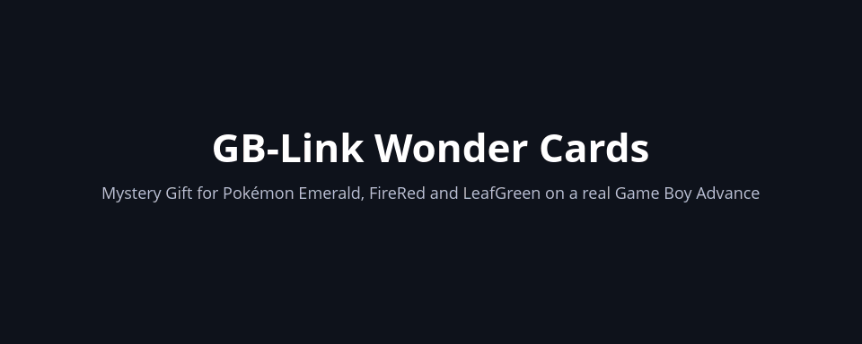

# GB-Link Wonder Cards

Send Mystery Gift Wonder Cards to Pokémon Emerald, FireRed and LeafGreen on a real Game
Boy Advance. A [GB-Link](https://gblink.io) USB adapter plays the part of a Wireless
Adapter, and this web page plays the distribution kiosk: the game finds it under
Mystery Gift, receives the card, and the deliveryman in any Pokémon Center hands over
the gift.

There are the classic event distributions (the Aurora, Mystic and Eon Tickets, the Old
Sea Map, Wish Eggs and more), as Project Wonder's distribution cartridges send them, and
the GB-Link Team's own cards: speed-up and slow-down, shiny hunting, event Pokémon,
Pokémon editing tools, and more. The team's cards also come as `.wc3` files for emulators
and save editors, and the page sends your own `.wc3` files too. The same link also backs up
the game's save to the page as a `.sav` file, and writes a `.sav` back.




## What you need

- A Game Boy Advance with Pokémon Emerald, FireRed or LeafGreen.
- A GB-Link adapter with firmware 2.2.6 or newer. Update it in the
  [GB-Link launcher](https://launcher.gblink.io).
- A **Game Boy Color** link cable between the Game Boy Advance and the GB-Link. Game Boy
  Advance link cables are missing pins this mode needs.
- Chrome, Edge or Firefox on a computer.

## Sending a card

1. **Unlock Mystery Gift in the game, once.** At the counter of any Poké Mart, fill in
   the questionnaire with the words LINK TOGETHER WITH ALL, then save. Mystery Gift now
   shows on the game's main menu. You need the Pokédex first.
2. **Connect.** Plug the GB-Link into the computer and link it to the Game Boy Advance
   with the Game Boy Color cable. Open the page, pick a card in the list, press
   *Connect* and choose the GB-Link.
3. **Receive it.** On the Game Boy Advance, pick MYSTERY GIFT on the main menu, then
   WONDER CARDS, then WIRELESS COMMUNICATION. The game finds the page by itself and
   takes the card. Keep the page open until it says the card was delivered, and let the
   game finish saving.
4. **Use it.** Walk up to the second floor of any Pokémon Center and talk to the
   deliveryman in green.

For another card, pick it on the page and start again from MYSTERY GIFT. A game keeps
one Wonder Card at a time:

- If it already has the card you are sending, the page asks whether to send it again.
- If it has a different one, the game asks whether to throw that one away.

## The cards

| Group | What it is |
| --- | --- |
| Pokémon Emerald | Emerald's event distributions: Aurora Ticket, Mystic Ticket, Old Sea Map, Eon Ticket, Altering Cave, Blisy's e-Reader unlock, and Youpileouf's French and German e-Reader unlocks |
| FireRed / LeafGreen | FireRed and LeafGreen's distributions: Aurora Ticket, Mystic Ticket, Altering Cave and the six Wish Eggs |
| Project Wonder (Goppier) | Goppier's distribution cartridges; most run on all three games, a few only on Emerald |
| GB-Link Team | The team's own cards |

The GB-Link Team cards run on Emerald, FireRed and LeafGreen in English, Japanese,
French, German, Italian and Spanish (the English and Japanese FireRed and LeafGreen in
both revisions), a few on only one of the games. The page sends each card only to the
games it runs on, and apart from the Master Ball the card checks the game again before it
does anything. The cards speak Japanese in the Japanese games and English in the others.

The Japanese games lay their Wonder Cards out differently, so the other groups' cards,
made for the other languages, don't go to them. Their Mystery Gift goes over ジョイスポット
(Joy Spot) where the others have Wireless Communication; the page shows a Japanese game
its own distributor beside the others'.

Some cards change how the game plays: the speed cards, Shiny Hunting, Pokémon Follow,
the roaming Pokémon lure, Travel Anywhere, PC Anywhere, Walk Through Walls, HM Moves Without HMs, the Exp.
Share for the whole party, Reusable TMs, the Gen 4 Physical/Special split and a few more. Their effect
lasts until the game is turned off or reset; after that, talk to the deliveryman again to
switch it back on.

## Sending your own .wc3

Under *Your own Wonder Card*, open a `.wc3` file, or drop one anywhere on the page. It is
listed as *Your .wc3 file* and sent like any other card. A `.wc3` is made for one game,
Emerald or FireRed and LeafGreen. When the file's name says which, as Project Pokémon
names its files (`E - …`, `FL - …`), the page asks before sending it to the other game.
Otherwise, send it only to the game it was made for. A Japanese `.wc3` (1,252 bytes,
where the others' have 1,420) goes only to the Japanese games, and the others' only to
the others.

## Backing up and restoring the save

*Back up the save* and *Restore a save* sit at the end of the event list, and go the same
way as a card: Mystery Gift, then Wireless Communication. A backup copies the whole
128 KB save to the page, which offers it as a `.sav` file for PKHeX or an emulator; the
game shows a message and saves nothing. A restore writes the chosen `.sav` beside the
cartridge's newest save, checks every sector, then lets the game load it and save. If
anything is off, or the link drops halfway, the cartridge keeps the save it had. Use a
`.sav` from the same game and language. Either takes one to four minutes, depending on how
much of the save is empty.

## Using the cards in an emulator

Every GB-Link Team card is also a `.wc3` file in [`wc3/`](wc3), in a folder for each
language and game: Emerald, FireRed and LeafGreen in French, German, Italian and
Spanish, and in English and Japanese Emerald, FireRed 1.0 and 1.1, LeafGreen 1.0 and
1.1. The page offers the one for the card you pick under *Use it in an emulator*.

1. Put the card into your save with PKHeX and its
   [WC3 plugin](https://github.com/Bl4ckSh4rk/PKHeXWC3Plugin), or with the
   [Mystery Gift Tool](https://github.com/projectpokemon/Gen3-WCTool). The Mystery Gift
   Tool needs Mystery Gift unlocked in the save.
2. Load the save and talk to the deliveryman upstairs in any Pokémon Center.

Pick the file for your game and its revision. On any other game, the deliveryman says
the gift doesn't work there.

The cards that give something once (the event Pokémon, the Starter Egg, the Gift Box, the
Rare Event Berries and the Master Ball) go by the game's "Mystery Gift done" flag. Receiving a card over Mystery Gift clears that flag;
putting one into the save does not. If the save has already had a gift, clear the flag
first: *Clear Egg Event flag* in the Mystery Gift Tool, or in PKHeX's event flags, flag
0x3D8 in FireRed and LeafGreen or 0x1E4 in Emerald.

A save copied off a cartridge works the same way: put the card in, then write the save
back.

## Running the page yourself

With Node.js 18 or newer:

```
npm install
npm run dev
```

The page is then at <https://localhost:5173>. The dev server uses its own certificate,
so accept the browser's warning once.

`npm run build` writes the finished site to `dist/`. It is plain static files, so any web
server can serve it. Browsers allow USB access on `localhost` over plain HTTP, so on your
own computer even `python3 -m http.server -d dist` works; anywhere else, serve it over
HTTPS.

## Making GB-Link Team cards

The GB-Link Team cards are built from source in `tools/native-cards`. The builder writes
each card's Wonder Card and script into `src/events/custom-wondercards.js`, one script
for every game version, since many addresses differ between them, and then the `.wc3`
files in `wc3/`. It needs the `arm-none-eabi` binutils (`as`, `ld`, `objcopy`, `nm`) on
your `PATH`.

```
node tools/native-cards/build.mjs
```

Running it again gives the same files, so after changing a card the diff shows only that
card. `node tools/native-cards/wc3.mjs` writes `wc3/` alone, from
`src/events/custom-wondercards.js`.

A card's texts in the Japanese games come from `tools/native-cards/japanese.mjs`, which
gives each English text of the builder its Japanese; the builder stops at one it can't
find. A message line there fits 16 characters, a Wonder Card's title 18, its subtitle 13
and a body line 18.

The addresses a card uses in each game are in `tools/native-cards/roms.mjs`, written by
`rom-symbols.mjs`. The English ROMs' come from pret's builds of pokeemerald and
pokefirered; the other languages' come from the ROMs themselves, where
`port-symbols.mjs` finds the English build's code. Run it again only when a card needs an
address no card used before, with the other languages' ROMs at the end:

```
node tools/native-cards/rom-symbols.mjs <pokeemerald dir> <pokefirered dir> <ROM>...
```

### Adding a card

1. **Add the card to the page's list.** In `src/events/custom-wondercards.js`, add an
   entry with its `id`, `label`, `description` and `roms: NATIVE_ROMS`, and leave its
   payloads empty:

   ```js
   {
     id: 'custom-my-card',
     label: 'My Card',
     description: 'What the card does, in a sentence or two.',
     roms: NATIVE_ROMS,
     payloads: {
     },
   },
   ```

2. **Describe it in `tools/native-cards/build.mjs`**, in the `CARDS` list, with the same
   `id`:

   - `card`: the Wonder Card itself, meaning its title, subtitle, four lines of text,
     the footer `FOOTER`, a card id no other card uses, the icon (a species number, in
     the games' internal order) and the background.
   - `script`: what the deliveryman does, written with the script helpers at the top of
     the file (`vmessage`, `yesnobox`, `additem` and so on) and the card's texts.
   - `source`: a `.s` file, only if the card needs ARM code of its own.

3. **Give its texts in Japanese** in `tools/native-cards/japanese.mjs`: the card's title,
   subtitle, its four lines as one text, and each message, by their English.

4. **Run the builder.** It fills in the payloads for every game.

### Things to know

- **The script has 995 bytes**, the space the game keeps for it. The builder stops with
  an error if a card doesn't fit.
- **Every card checks the game first.** The builder starts each script with a check of
  the game's name, language and version, and on any other game the deliveryman says
  the gift doesn't work there.
- **Move the script before leaving the overworld.** When the game comes back to the
  overworld from a menu, a battle, a minigame or the naming screen, it moves the save
  data the script runs from, by a random amount, and a script that carries on after
  that runs the wrong bytes. Put `...relocate()` in the script just before anything
  that leaves the overworld. It copies the script to a fixed place first; the card's
  `source` must include `relocate.inc` for it (`casino.s` is the smallest example).

## Repository layout

| Path | What's there |
| --- | --- |
| `index.html`, `src/main.js`, `src/assets/` | The page |
| `src/link/` | Talking to the GB-Link, the wireless link the game sees, and the Mystery Gift exchange |
| `src/events/` | Every card the page can send |
| `tools/native-cards/` | The builder and sources of the GB-Link Team cards |
| `wc3/` | The GB-Link Team cards as `.wc3` files, a folder for each language and game |
| `docs/` | The demo at the top of this page |
| `launcher-return.js` | A link back to the GB-Link launcher, when the page was opened from it |
## License

GPL-3.0; see [LICENSE](LICENSE).
